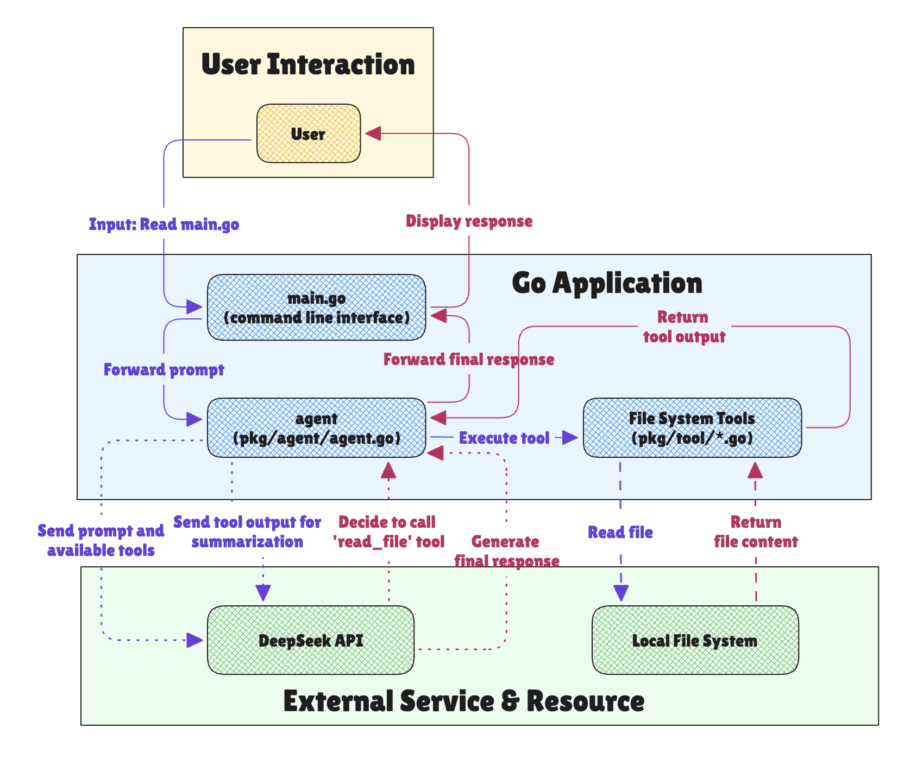

# Code Editing Agent

[](https://goreportcard.com/report/github.com/promacanthus/code-editing-agent)
[](https://pkg.go.dev/github.com/promacanthus/code-editing-agent)
[](https://github.com/promacanthus/code-editing-agent)
[](LICENSE)
[](https://github.com/promacanthus/code-editing-agent/commits/main)
[](https://github.com/securecodewarrior/gosec)
[](https://github.com/promacanthus/code-editing-agent)
[](https://github.com/promacanthus/code-editing-agent)


This project is a Go-based code editing agent that uses the DeepSeek language model to interact with your codebase. It's inspired by the tutorial [How to Build an Agent](https://ampcode.com/how-to-build-an-agent), but it has been adapted to use the DeepSeek API instead of the Claude API.

## Architecture



## Features

* **Interactive Chat:** Chat with the agent to give it instructions.
* **File System Tools:** The agent can:
  * List files and directories.
  * Read the contents of files.
  * Edit files by replacing text.
* **Powered by DeepSeek:** The agent uses the DeepSeek language model to understand your requests and generate code.

## How It Works

The agent works by sending your chat messages to the DeepSeek API, along with a set of available tools. The DeepSeek model can then decide to use one of these tools to fulfill your request.

For example, if you ask the agent to "read the `main.go` file", it will call the `read_file` tool with the path `main.go`. The output of the tool will then be sent back to the DeepSeek model, which will use it to generate a response.

## Getting Started

### Prerequisites

* Go 1.24.5 or later
* A DeepSeek API key

### Installation

1. Clone the repository:

    ```bash
    git clone https://github.com/promacanthus/code-editing-agent.git
    ```

2. Navigate to the project directory:

    ```bash
    cd code-editing-agent
    ```

3. Install the dependencies:

    ```bash
    go mod tidy
    ```

### Configuration

The agent requires a DeepSeek API key to be set in the `main.go` file. Replace `"YOUR_DEEPSEEK_API_KEY"` with your actual API key:

```go
// main.go
client := deepseek.NewClient("YOUR_DEEPSEEK_API_KEY")
```

### Usage

To run the agent, execute the following command:

```bash
go run main.go
```

You can then start chatting with the agent in your terminal.

## Tools

The following tools are available to the agent:

* `list_files`: List files and directories at a given path.
* `read_file`: Read the contents of a given file.
* `edit_file`: Make edits to a text file.

## Project Structure

```shell
.
├── go.mod
├── go.sum
├── main.go
└── pkg
    ├── agent
    │   └── agent.go
    └── tool
        ├── edit_file.go
        ├── list_files.go
        ├── read_file.go
        └── types.go
```

* `main.go`: The entry point of the application.
* `pkg/agent/agent.go`: Contains the core logic for the agent.
* `pkg/tool/`: Contains the definitions for the available tools.

## Acknowledgments

* This project is based on the tutorial [How to Build an Agent](https://ampcode.com/how-to-build-an-agent).
* The agent uses the [deepseek-go](https://github.com/cohesion-org/deepseek-go) library to interact with the DeepSeek API.
